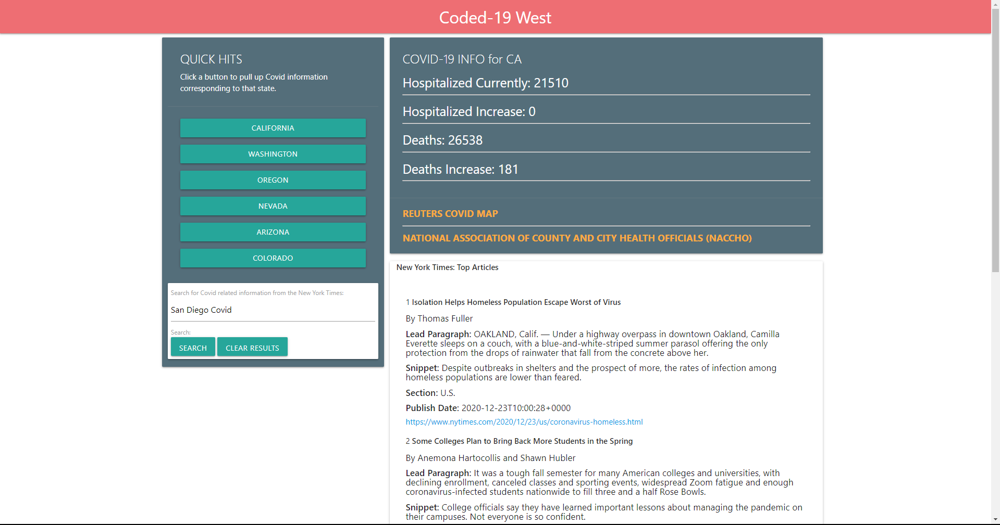

# Coded 19 ReadMe

This is a web application focused on finding COVID-19 cases near the individual, so as to better educate and ensure safety from the pandemic.

This COVID-19 data is sourced from two reliable APIs:
The COVID tracking project - https://covidtracking.com/data/api

and
the New York Times - https://developer.nytimes.com/ .

# Team Members:

### Shane O’Connell

### Travis Ko

### Elijah Davis

### Guled Ahmed

# Project Description:

This website is a COVID-19 Data application that allows the user to see real-time updates such as deaths and currently hospitalized from the Coronavirus (Covid-19) in his/her state. This application will also allow the user to search for New York Times articles pertaining to Covid-19.

# User Story:

AS A citizen concerned for his/her wellbeing.

I WANT to know the status of the Covid-19 virus

SO THAT I can be better informed about the areas hit the hardest in regards to the Covid-19 pandemic .

# Here is a link to the deployed application:

Coded-19 App Github link:
https://elijahig.github.io/Coded-19-app/

# Here is a screenshot of the application:

